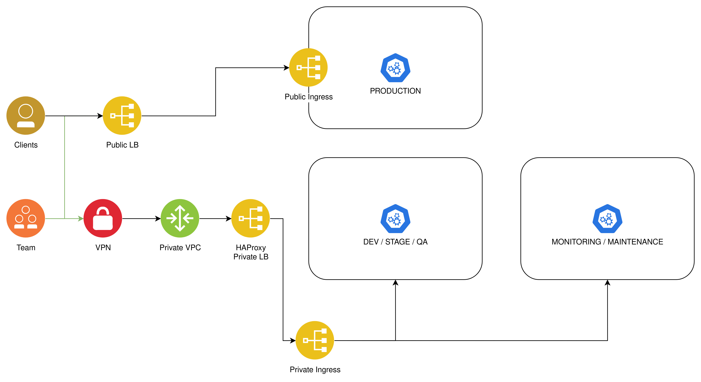
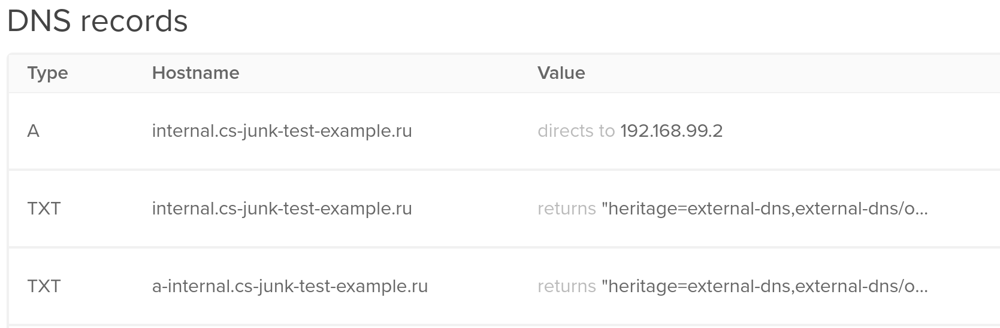
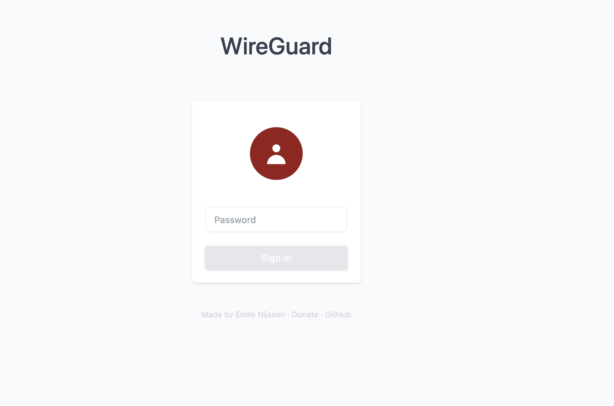
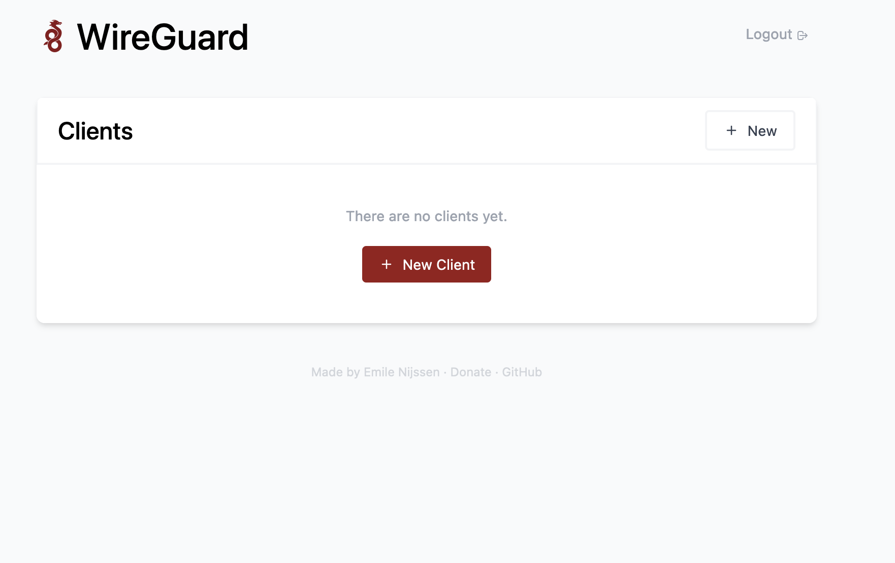
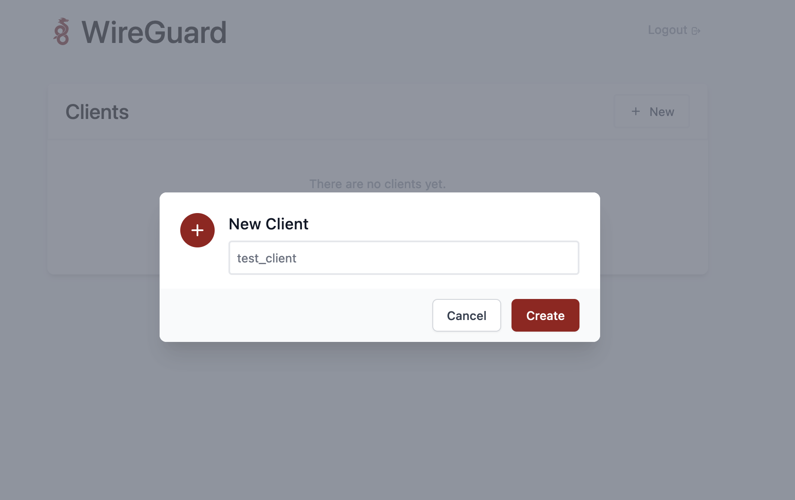
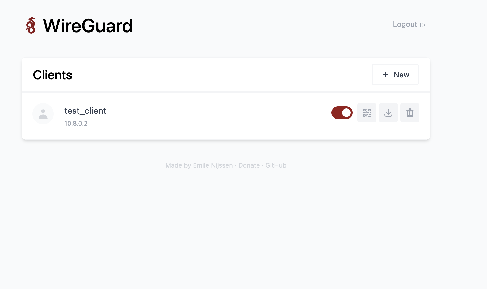
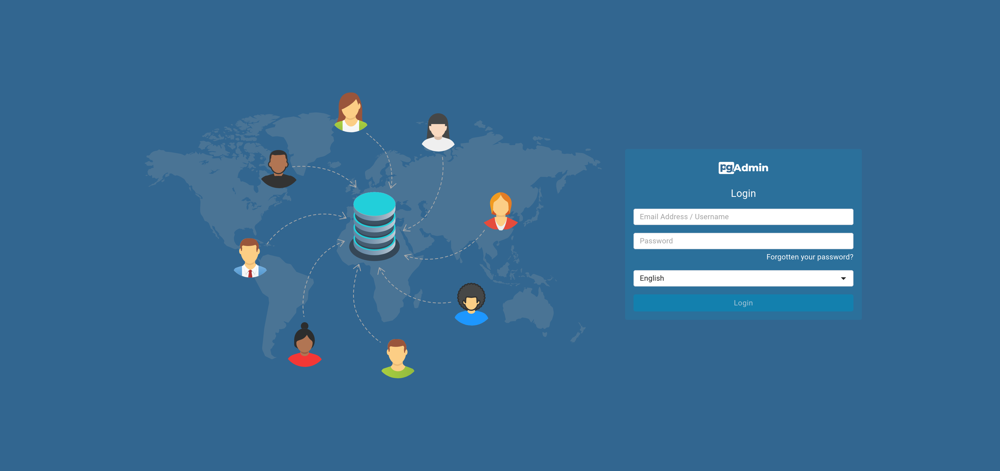

# Kubernetes, WireGuard, DigitalOceanss Private LoadBalancer - построение закрытого dev/stage окружения для разработки.

> **IMPORTANT REQUIREMENTS!** Kubernetes - это важная часть этого гайда. Если вы совсем новичок в kubernetes и вас пугают такие слова как `pod`, `service`, `helm chart`, `deployment`, `kubectl`, то перед тем как продолжать, я настоятельно рекомендую пройти какой нибудь курс по kubernetes. Например [вот этот](https://www.youtube.com/playlist?list=PLg5SS_4L6LYvN1RqaVesof8KAf-02fJSi).

> **LESS IMPORTANT REQUIREMENTS!**: Весь код который я буду писать, я намеренно буду упрощать, где-то дублируя, то что можно вынести в переменные или модули, где-то не включая дополнительные настройки, и.т.д. Это нужно для того, что бы сосредоточится на том как достичь поставленного результата и не раздувать гайд еще больше (он и так планируется не маленький). Прошу понять, простить и не сильно плевать мне в лицо при встрече.

Знаний в хату господа, через этот набор символов, картинок и примеров, я хочу поделится с вами своим опытом, в настройке приватного **dev/stage** контура для команд разработки, внутри кластера Kubernetes, на [DigitalOcean cloud](https://www.digitalocean.com/). Сразу отвечу на вопрос **Нахрена?** - часто так бывает, что люди, которые занимаются инфраструктурой, да и сами компании, не заботятся о том, как устроена их инфраструктура с точки зрения безопасности и как правило не могут ответить на такие вопросы как:

- Какие доступы есть у тех или иных людей к кластеру kubernetes?
- Какие ресурсы и приложения развернуты внутри кластера?
- Как настроены политики взаимодействия ресурсов внутри кластера (Network Policies)
- К каким ресурсам или приложениям внутри кластера kubernetes, есть доступ у всех желающих через публичную сеть?

Сегодня я хочу поговорить, на тему последнего вопроса. Чисто, из моего опыта, я могу ответить на него так - **вообще к любым!**. Приходя на проект, в стартапы или небольшие компании я вижу, что на инфраструктуру и её безопасность в частности (кладут х**) обращают внимание в последнюю очередь потому, что отдают это на откуп либо фрилансерам, либо junior специалистам, а иногда и вовсе просят все это делать команду разработки, ведь **у нас кросс функциональная команда вообще-то!**, а на самом деле так попросту дешевле. Вот и получается такая ситуация, когда любой желающий, просто зная домен компании может попробовать проанализировать домен, найти какие нибудь поддомены и получить доступ к develop окружению или к какому нибудь инфраструктурному приложению по типу prometheus dashboard или pgadmin, который также забыли закрыть хоть насколько нибудь безопасным паролем.

На мой субъективный взгляд - это проблема, которая требует решения вне зависимости от того, каких размеров ваш продукт, ведь насколько бы безопасным вы не сделали свое приложение, но дырявая инфраструктура - это залог украденной базы, отказа в обслуживании и других, не очень приятных последствий. Решать данную проблему можно разными способами, например:

1. Правильно настроенной авторизацией (basic auth с нормальным паролем к каждому приложению, oauth2-proxy, third-party auth providers, etc)
2. VPN и разграничением вашей инфраструктуры, на приватный и публичный сегмент.

Вообще, эти два варианта даже можно комбинировать, но давайте пока не будем забегать так далеко. Оба способа имеют свои плюсы и минусы, но мы рассмотрим именно второй несмотря на то, что он более сложен в реализации. Он дает достаточный уровень безопасности, который позволяет на первых порах пренебречь всем остальным. В дальнейшем, как появятся время и деньги можно усиливать степень защиты другими способами и инструментами.

Все что мы будем делать в рамках этого гайда, мы будем делать на основе [DigitalOcean cloud](https://www.digitalocean.com/) и его DKS (managed kubernetes cluster) потому, что именно у данного облачного провайдера отсутствуют некоторые механизмы (а именно: приватный балансировщик нагрузки и VPN), которые на какой-то момент поставили меня в тупик и заставляют придумывать велосипеды, которые были неудобны как для команды разработки, которая этим пользовалась, так и для поддержки, но затем из-за этих ограничений я пришел к варианту, который я хочу вам показать и на самом деле этот вариант можно реализовать на любом облачных провайдере и даже на bare metal серверах, но в некоторых более навороченных облачных провайдерах, по типу aws, gcp или azure, все это можно закидать деньгами но сделать гораздо проще.

Итак, что мы сегодня сделаем и с чем поработаем?

1. Поднимем небольшой кластер **kubernetes** в [DigitalOcean cloud](https://www.digitalocean.com/) при помощи [terraform](https://www.terraform.io/).
2. Настроим [external-dns](https://github.com/kubernetes-sigs/external-dns) для управления доменными записями изнутри кластера.
3. Настроим [nginx-ingress-controller](https://docs.nginx.com/nginx-ingress-controller/), для доступа к приложениям кластера из публичной и приватной сети.
4. Поднимем небольшой [haproxy](https://www.haproxy.org/) сервер, который будет выступать в качестве входной точки, в нашу приватную инфраструктуру.
5. Поднимем и настроим [WireGuard VPN](https://www.wireguard.com/) и дашборд [easy-wg](https://github.com/wg-easy/wg-easy) для удобного взаимодействия с ним.

Погнали!

Какой результат мы хотим в конечном итоге получить?



Как показано на картинке выше у нас есть два разных сегмента сети для разных групп пользователей:

1. Публичный сегмент сети - для наших клиентов. В этом сегменте располагаются наши production приложения.
2. Приватный сегмент сети - для команд разработки. В этом сегменте могут располагаться dev, stage, qa окружения, админки, сервисы мониторинга и поддержки, и.т.д.

У обоих сегментов есть собственные LB, ingresses, и собственные сегменты сети (публичная с доступом из всего интернета или приватная с доступом только изнутри облачной подсети), но в приватном сегменте также добавляется один важный элемент - VPN, который будет предоставлять работникам доступ к приватной сети облака, а значит и к нашим приватным ресурсам. Таким образом, группа пользователей **clients** не смогут получить доступ к приватному сегменту потому, что они не смогут приконнектится к нашему VPN серверу. На словах и схемах выглядит надежно и не сложно, давайте попробуем реализовать.

## Kubernetes cluster

Для того, что бы начать нам потребуется:

1. Зарегестрировать аккаунт в [DigitalOcean](https://try.digitalocean.com/freetrialoffer/) по данной ссылке и получить халявные 200 кредитов на поиграться.
2. Сгенерировать api-token (сохраните пока куда нибудь в отдельный файлик он нам еще понадобится). [Вот документация, как это сделать](https://docs.digitalocean.com/reference/api/create-personal-access-token/)
3. Сгенерируйте key и secret для S3 стораджа. Это понадобится нам для работы через terraform как и api-token, поэтому также пока сохраняем куда нибудь. [Вот документация, как это сделать](https://docs.digitalocean.com/products/spaces/how-to/manage-access/)
4. Скачать и установить [Terraform](https://developer.hashicorp.com/terraform/tutorials/aws-get-started/install-cli). Для разных ОС установка отличается, поэтому справитесь как нибудь сами.
5. Купить или каким либо образом получить доменное имя для вашего проекта.  Также нам необходимо передать управление нашим доменом на сторону облака, для этого необходимо, там где вы покупали домен изменить **NS** записи, на NS записи от облака. У каждого поставщика доменов есть свой UI или API для этого, поэтому с этим вы должны справиться самостоятельно. Я лишь, в свою очередь могу поделится NS записями от [DigitalOcean](https://www.digitalocean.com/), которые вы должны использовать.

```shell
ns1.digitalocean.com.
ns2.digitalocean.com.
ns3.digitalocean.com.
```

Если вы вдруг, никогда не работали с terraform и вообще не в курсе, что это за хрень такая, как и IaC (infrastructure as Code) то [вот](https://habr.com/ru/companies/piter/articles/351878/), [вот](https://developer.hashicorp.com/terraform?product_intent=terraform) и [вот](https://www.youtube.com/watch?v=ph4iNA0Uuko) вам на почитать и посмотреть.

После всех подготовительных шагов мы готовы инициализировать terraform проект. Для этого давайте создадим где нибудь папочку `testproject/terraform` и создадим внутри неё файлик `main.tf` со следующим содержимым.

```terraform
terraform {
  required_version = "1.5.7"

  required_providers {
    digitalocean = {
      source  = "digitalocean/digitalocean"
      version = "2.30.0"
    }
  }

  backend "s3" {
    endpoint                    = "ams3.digitaloceanspaces.com"
    key                         = "testapp.tfstate"
    bucket                      = "testapp-terraform"
    region                      = "us-west-1"
    skip_requesting_account_id  = true
    skip_credentials_validation = true
    skip_get_ec2_platforms      = true
    skip_metadata_api_check     = true
  }
}

variable "do_token" {}
provider "digitalocean" {
  token = var.do_token
}
```

[Секция terraform](https://developer.hashicorp.com/terraform/tutorials/gcp-get-started/google-cloud-platform-build#terraform-block) - это секция где мы указываем различную meta-информацию, которая нужна только для terraform и его корректной работы. Тут мы указываем:

- **required_version** - версия terraform, с которой работает текущий код. Иногда бывает так, что от версии к версии ломается API самого terraform и в таком случае код, который был написан с использованием версии 0.1 попросту не работает с версией 0.2 или выше. Это может быть обнаружено не сразу, а в момент работы terraform при построении плана или применении изменени. Это может привести к поломке terraform state и долгим часам восстановления. Указанием **required_version** мы говорим terraform, что бы он в первую очередь проверил версию, которая написана в коде и версию установленной утилиты и выбросил ошибку если установленная версия не подходит под **required_version** и ничего больше не делал.
- **required_providers** - тут мы импортируем модули (провайдеры), с которыми собираемся работать. Мы работаем с DigitalOcean облаком поэтому будем использовать их официальный провайдер.
- **backend** - тут располагаются настройки хранения terraform state. По умолчанию, в качестве бэкенда для хранения состояния, выступает локальная файловая система. Мы же собираемся хранить состояние на удаленном S3 хранилище, для того, чтобы этот код можно было запускать не только локально, но и например внутри CI пайплайна. Настройки с префиксом **skip_*** - это настройки, которые нужны именно для DigitalOcean облака, потому что их API работает поверх **Amazon S3** и если не выключать некоторый функционал, то мы будем натыкаться на разного рода ошибки при инициализации или запуске.

[Секция provider](https://developer.hashicorp.com/terraform/tutorials/gcp-get-started/google-cloud-platform-build#providers) - это настройки конкретного провайдера. Тут мы указываем digitalocean api token для доступа к API нашего клауда.

Теперь мы можем запустить следующую команду в терминале.

> Не забудьте заменить *** на ваши значения. Помните про S3 ключи которые мы создавали? Вот они нам и пригодились!

```bash
terraform -chdir=./terraform init -backend-config="access_key=***" -backend-config="secret_key=***"
```

После мы должны увидеть в терминале примерно следующую картину

```shell
Initializing the backend...

Successfully configured the backend "s3"! Terraform will automatically
use this backend unless the backend configuration changes.

Initializing provider plugins...
- Finding digitalocean/digitalocean versions matching ">= 2.4.0"...
- Installing digitalocean/digitalocean v2.30.0...
- Installed digitalocean/digitalocean v2.30.0 (signed by a HashiCorp partner, key ID F82037E524B9C0E8)

Partner and community providers are signed by their developers.
If you'd like to know more about provider signing, you can read about it here:
https://www.terraform.io/docs/cli/plugins/signing.html

Terraform has created a lock file .terraform.lock.hcl to record the provider
selections it made above. Include this file in your version control repository
so that Terraform can guarantee to make the same selections by default when
you run "terraform init" in the future.

Terraform has been successfully initialized!

You may now begin working with Terraform. Try running "terraform plan" to see
any changes that are required for your infrastructure. All Terraform commands
should now work.

If you ever set or change modules or backend configuration for Terraform,
rerun this command to reinitialize your working directory. If you forget, other
commands will detect it and remind you to do so if necessary.
```

Теперь в нашем, пустом пока что проекте, нам нужно создать несколько базовых ресурсов для дальнейшей работы. Во первых, давайте создадим ресурс домена, для того чтобы потом, успешно привязывать к нему всевозможные DNS записи. Для этого в файле `testproject/terraform/main.tf` мы положим следующие строчки.

> Не забудьте заменить yourdomain.com на свой собственный домен.

```terraform
resource "digitalocean_domain" "default" {
  name = "yourdomain.com"
}
```

На этом пока что все, позже мы вернемся к этому ресурсу, для добавление новых DNS записей к домену (например для добавление поддоменнов).

Вторым важным ресурсом будет - **VPC**. **VPC** - это приватная подсеть для наших облачных ресурсов (kubernetes/droplets). В VPC сеть, нельзя просто так попасть из публичной сети и чаще всего, они служат для внутренней коммуникации между серверами. Наш будущий kubernetes кластер, а точнее его рабочие узлы (worker nodes) и мастер узлы (master nodes) будут общаться между собой через эту внутреннюю подсеть. А также, мы, настроим VPN туннель для доступа в эту VPC, тем самым организуя доступ до приватных ресурсов, которые не будут доступны из публичной сети. Для того что бы создать нашу VPC, мы положим следующие строчки в `testproject/terraform/main.tf`.

```terraform
resource "digitalocean_vpc" "private" {
  name     = "private-network"
  region   = "ams3"
  ip_range = "192.168.99.0/24"
}
```

Теперь, запустим `terraform plan` и посмотрим, какие изменения в нашей инфраструктуре нас ожидают. У нас полностью пустой проект и я ожидаю увидеть от плана только создание VPC и домена.

> Не забудьте изменить *** на свои значения.

```shell
terraform -chdir=./terraform plan -var="do_token=***"

Terraform used the selected providers to generate the following execution plan. Resource actions are indicated with the following symbols:
  + create

Terraform will perform the following actions:

  # digitalocean_domain.default will be created
  + resource "digitalocean_domain" "default" {
      + id   = (known after apply)
      + name = "yourdomain.com"
      + ttl  = (known after apply)
      + urn  = (known after apply)
    }

  # digitalocean_vpc.private will be created
  + resource "digitalocean_vpc" "private" {
      + created_at = (known after apply)
      + default    = (known after apply)
      + id         = (known after apply)
      + ip_range   = "192.168.99.0/24"
      + name       = "private-network"
      + region     = "ams3"
      + urn        = (known after apply)
    }

Plan: 2 to add, 0 to change, 0 to destroy.
```

Если нас все устраивает, мы можем смело применить эти изменения к нашему клауд проекту при помощи `terraform -chdir=./terraform apply --auto-approve -var="do_token=***"`. Но есть одно **НО**.

Тут мы встречаем первый нюанс. На данном этапе, мы работаем с чистым проектом в DigitalOcean, там еще не создано, ни одного ресурса, в том числе не одной VPC сети. А у DigitalOcean есть одна особенность, она заключается в том, что первая созданная VPC сеть становится VPC сетью по умолчанию и её больше никак нельзя удалить. На попытку это сделать DigitalOcean ответит вам ошибкой с текстом **Can not delete default VPCs**. Поэтому перед тем как применить наши изменения, нам нужно пойти в DigitalOcean UI и руками создать одну VPC сеть, благо они бесплатные. Более подробное описание, как добавить VPC через UI - [тут](https://docs.digitalocean.com/products/networking/vpc/how-to/create/).

После этого, применяем изменения и мы должны увидеть примерно следующие.

> Не забудьте изменить *** на свои значения.

```shell
terraform -chdir=./terraform apply --auto-approve -var="do_token=***"

Terraform used the selected providers to generate the following execution plan. Resource actions are indicated with the following symbols:
  + create

Terraform will perform the following actions:

  # digitalocean_domain.default will be created
  + resource "digitalocean_domain" "default" {
      + id   = (known after apply)
      + name = "yourdomain.com"
      + ttl  = (known after apply)
      + urn  = (known after apply)
    }

  # digitalocean_vpc.private will be created
  + resource "digitalocean_vpc" "private" {
      + created_at = (known after apply)
      + default    = (known after apply)
      + id         = (known after apply)
      + ip_range   = "192.168.99.0/24"
      + name       = "private-network"
      + region     = "ams3"
      + urn        = (known after apply)
    }

Plan: 2 to add, 0 to change, 0 to destroy.
digitalocean_domain.default: Creating...
digitalocean_vpc.private: Creating...
digitalocean_domain.default: Creation complete after 1s [id=csjunk.info]
digitalocean_vpc.private: Creation complete after 1s [id=f70e79a8-476d-444d-b583-283f662ba92f]

Apply complete! Resources: 2 added, 0 changed, 0 destroyed.
```

Теперь, приступим к созданию kubernetes кластера. Для managed kubernetes, сделать это достаточно просто. Создаем файлик `testproject/terraform/kube_cluster.tf` и добавляем туда следующие строчки.

```terraform
resource "digitalocean_kubernetes_cluster" "primary" {
  name          = "primary"
  region        = "ams3"
  version       = "1.28.2-do.0"
  vpc_uuid      = digitalocean_vpc.private.id

  node_pool {
    name       = "worker-pool"
    size       = "s-2vcpu-4gb"
    node_count = 1
  }
}
```

Из интересного:

- **vpc_uuid** - сюда помещаем идентификатор VPC, которую мы создали на предыдущем шаге.
- **node_pool.size** - размер DigitalOcean дроплетов (сколько виртуальных CPU, сколько памяти, и.т.д.). Вопрос только в том, как узнать какие размеры есть? Сделать это можно через специальный API запрос. Почитать можно в [документации](https://docs.digitalocean.com/reference/api/api-reference/#operation/sizes_list)

После этого, двигаемся по старой схеме `terraform plan` -> `terraform apply` и в конце концов получаем следующую картину в терминале.

> Не забудьте изменить *** на свои значения.

```shell
terraform -chdir=./terraform apply --auto-approve -var="do_token=***"

digitalocean_vpc.private: Refreshing state... [id=f70e79a8-476d-444d-b583-283f662ba92f]
digitalocean_domain.default: Refreshing state... [id=csjunk.info]

Terraform used the selected providers to generate the following execution plan. Resource actions are indicated with the following symbols:
  + create

Terraform will perform the following actions:

  # digitalocean_kubernetes_cluster.primary will be created
  + resource "digitalocean_kubernetes_cluster" "primary" {
      + cluster_subnet                   = (known after apply)
      + created_at                       = (known after apply)
      + destroy_all_associated_resources = false
      + endpoint                         = (known after apply)
      + ha                               = false
      + id                               = (known after apply)
      + ipv4_address                     = (known after apply)
      + kube_config                      = (sensitive value)
      + name                             = "primary"
      + region                           = "ams3"
      + registry_integration             = false
      + service_subnet                   = (known after apply)
      + status                           = (known after apply)
      + surge_upgrade                    = true
      + updated_at                       = (known after apply)
      + urn                              = (known after apply)
      + version                          = "1.28.2-do.0"
      + vpc_uuid                         = "df0df865-eda4-4237-8b7f-2e0808be9cfb"

      + node_pool {
          + actual_node_count = (known after apply)
          + auto_scale        = false
          + id                = (known after apply)
          + name              = "worker-pool"
          + node_count        = 1
          + nodes             = (known after apply)
          + size              = "s-2vcpu-4gb"
        }
    }

Plan: 1 to add, 0 to change, 0 to destroy.
...
digitalocean_kubernetes_cluster.primary: Still creating... [3m30s elapsed]
digitalocean_kubernetes_cluster.primary: Still creating... [3m40s elapsed]
digitalocean_kubernetes_cluster.primary: Still creating... [3m50s elapsed]
digitalocean_kubernetes_cluster.primary: Still creating... [4m0s elapsed]
digitalocean_kubernetes_cluster.primary: Still creating... [4m10s elapsed]
digitalocean_kubernetes_cluster.primary: Still creating... [4m20s elapsed]
digitalocean_kubernetes_cluster.primary: Still creating... [4m30s elapsed]
digitalocean_kubernetes_cluster.primary: Still creating... [4m40s elapsed]
digitalocean_kubernetes_cluster.primary: Still creating... [4m50s elapsed]
digitalocean_kubernetes_cluster.primary: Still creating... [5m0s elapsed]
digitalocean_kubernetes_cluster.primary: Still creating... [5m10s elapsed]
digitalocean_kubernetes_cluster.primary: Still creating... [5m20s elapsed]
digitalocean_kubernetes_cluster.primary: Still creating... [5m30s elapsed]
digitalocean_kubernetes_cluster.primary: Still creating... [5m40s elapsed]
digitalocean_kubernetes_cluster.primary: Still creating... [5m50s elapsed]
digitalocean_kubernetes_cluster.primary: Still creating... [6m0s elapsed]
digitalocean_kubernetes_cluster.primary: Still creating... [6m10s elapsed]
digitalocean_kubernetes_cluster.primary: Creation complete after 6m12s [id=5aa06abd-421e-46d8-8fc5-87a3475ef5bc]

Apply complete! Resources: 1 added, 0 changed, 0 destroyed.
```

Готово! Оказывается, что создать kubernetes кластер, не так уж и сложно правда? Нам осталось всего лишь получить доступ до нашего кластера, а для этого нам нужен kubeconfig. Получить админский конфиг можно через UI. Как это сделать читаем [тут](https://docs.digitalocean.com/products/kubernetes/how-to/connect-to-cluster/). После того как скачали конфиг, проверяем что у нас есть доступ до нашего кластера.

> Сохраните ваш конфиг в директорию `testproject/creds` команды будут выполнять с учетом того, что kubeconfig лежит в этой директории.

```shell
kubectl --kubeconfig=./creds/primary-kubeconfig.yaml get nodes

NAME                STATUS   ROLES    AGE   VERSION
worker-pool-y2wrt   Ready    <none>   27m   v1.28.2
```

Если у вас примерно такая же картина как и у меня и нет никаких ошибок, значит вы все сделали правильно и мы закончили с большим первым шагом, вы большие молодцы, погнали дальше.

## External DNS

[External DNS](https://github.com/kubernetes-sigs/external-dns) - позволяет нам управлять нашим доменном (при условии, что это позволяет делать API того ресурса где располагается домен) изнутри kubernetes кластера. Под управлением доменом, я подразумеваю создание и удаление DNS записей. Мы еще в самом начале передали управление доменом нашему облачному провайдеру, а external-dns вполне себе неплохо работает с DigitalOcean DNS API.

Для того, что бы задеплоить external-dns к нам в кластер, мы делаем следующие. Создаем себе директорию `testproject/kubernetes/deployments/external-dns` и внутри неё создаем файлик `deployment.yaml` со следующим содержимым.

```yaml
apiVersion: v1
kind: ServiceAccount
metadata:
  name: external-dns
---
apiVersion: rbac.authorization.k8s.io/v1
kind: ClusterRole
metadata:
  name: external-dns
rules:
- apiGroups: [""]
  resources: ["services","endpoints","pods"]
  verbs: ["get","watch","list"]
- apiGroups: ["networking","networking.k8s.io"]
  resources: ["ingresses"]
  verbs: ["get","watch","list"]
- apiGroups: [""]
  resources: ["nodes"]
  verbs: ["get","watch","list"]
---
apiVersion: rbac.authorization.k8s.io/v1
kind: ClusterRoleBinding
metadata:
  name: external-dns-viewer
roleRef:
  apiGroup: rbac.authorization.k8s.io
  kind: ClusterRole
  name: external-dns
subjects:
- kind: ServiceAccount
  name: external-dns
  namespace: default
---
apiVersion: apps/v1
kind: Deployment
metadata:
  name: external-dns
spec:
  replicas: 1
  selector:
    matchLabels:
      app: external-dns
  strategy:
    type: Recreate
  template:
    metadata:
      labels:
        app: external-dns
    spec:
      serviceAccountName: external-dns
      containers:
      - name: external-dns
        image: registry.k8s.io/external-dns/external-dns:v0.13.5
        args:
        - --source=service
        - --domain-filter=<YOUR_DOMAIN>
        - --provider=digitalocean
        env:
        - name: DO_TOKEN
          value: "<DO_TOKEN>"
```

Это template деплоймента, поэтому вам необходимо заменить несколько вещей перед деплоем:

- **<DO_TOKEN>** - на ваш настоящий DigitalOcean API token. Потому что все действия external-dns будет производить через API, а в API без токена не пускают.
- **<YOUR_DOMAIN>** - это опционально. Параметр `--domain-filter` ограничивает работу external-dns. С этой настройкой external-dns будет создавать только те DNS записи, доменом которых является **<YOUR_DOMAIN>**.

Теперь запускаем следующую команду и смотрим на результат, если все хорошо, то вы должны увидеть в терминале, что были созданы несколько ресурсов.

```shell
kubectl --kubeconfig=./creds/primary-kubeconfig.yaml apply -f ./kubernetes/deployments/external-dns/deployment.yaml 
serviceaccount/external-dns created
clusterrole.rbac.authorization.k8s.io/external-dns created
clusterrolebinding.rbac.authorization.k8s.io/external-dns-viewer created
deployment.apps/external-dns created
```

И проверяем.

```shell
kubectl --kubeconfig=./creds/primary-kubeconfig.yaml get pods

NAME                            READY   STATUS   RESTARTS     AGE
external-dns-5c77b8df4c-xz5gj   0/1     Error    1 (1s ago)   4s
```

Если вы увидели в терминале тоже самое, то на 90% вы сделали все верно и можно переходить к следующему шагу.

## Ingress controller

На самом деле нам нужно будет развернуть не один ingress, а как показано на самой первой картинке с со схемой этого бардака, аж два. Первый для публичных сервисов, к которым разрешается ходить из интернета и приватный, к которому будет доступ только из под нашей VPC подсетки.

Для того, что бы разворачивать некоторые приложения (в том числе наши ingress контроллеры), я буду использовать helm и helm чарты. Так что, если вы не знаете, что это такое - то бегом [читать](https://helm.sh/ru/docs/), [смотреть](https://www.youtube.com/watch?v=vWZZjoILeos) и [устанавливать](https://helm.sh/ru/docs/intro/install/).

Итак для хранения helm чартов я создам отдельную директорию `testproject/kubernetes/charts` и внутри неё создам еще две директории, под каждый из ingress controller соответственно.

1. `testproject/kubernetes/charts/private-ingress`
2. `testproject/kubernetes/charts/public-ingress`

И начнем с установки самого простого - это **public-ingress**. Внутри директории `testproject/kubernetes/charts/public-ingress` нам необходимо создать файлик конфигурации `values.yaml` и заполнить его следующим содержимым.

```yaml
service:
  type: LoadBalancer
```

Конфигурация крайне проста для пользователя и не требует большого кол-ва настроек. Нам всего лишь нужно указать, что service нашего ingress контроллера имеет тип **LoadBalancer**.

> **Будьте осторожны!** Когда вы задеплоить этот helm чарт, то в DigitalOcean будет создан новый балансировщик нагрузки для вашего ingress контроллера, а балансировщики в свою очередь, не является бесплатным, поэтому с вас могут сниматься деньги за его использование, но пока у нас есть халявные кредиты за это можно не волноваться.

Устанавливаем.

```shell
helm --kubeconfig=./creds/primary-kubeconfig.yaml upgrade --install -n nginx-ingress --create-namespace -f ./kubernetes/charts/public-ingress/values.yaml nginx-ingress-controller oci://registry-1.docker.io/bitnamicharts/nginx-ingress-controller
```

И проверяем

```shell
kubectl --kubeconfig=./creds/primary-kubeconfig.yaml -n nginx-ingress get pods

NAME                                                        READY   STATUS    RESTARTS   AGE
nginx-ingress-controller-58d5fd7cc4-qv7n9                   1/1     Running   0          3m18s
nginx-ingress-controller-default-backend-56576d8d4b-xrnfx   1/1     Running   0          3m18s
```

Также после этого, у вас должен был создаться облачный балансировщик нагрузки и если вы перейдете по его IP адресу то должны получить заветный ответ 404 от nginx.


Теперь нам нужно повторить это же упражнение, только для **private-ingress** за исключением того, что мы чутка изменим конфигурацию. Создаем файл `testproject/kubernetes/charts/private-ingress/values.yaml` и заполняем его следующим содержимым.

```yaml
ingressClassResource:
  name: nginx-private

externalTrafficPolicy: Local
config:
  compute-full-forwarded-for: "true"
  use-forwarded-headers: "true"
  use-proxy-protocol: "true"

service:
  type: NodePort
  nodePorts:
    http: 30080
    https: 30443
  annotations:
    kubernetes.digitalocean.com/firewall-managed: "false"
    external-dns.alpha.kubernetes.io/hostname: "internal.yourdomain.com"
    external-dns.alpha.kubernetes.io/ttl: "300"
    external-dns.alpha.kubernetes.io/access: "private"
```

Вот список изменений (по сравнению с public)

- **ingressClassResource** - мы обязаны его поменять, потому что - это идентификатор ingress контроллера, к которому будут цеплятся остальные приложения. Например публичному приложению мы скажем, что его **ingressСlassName** - это **nginx** и тогда это приложение будет доступно из публичной сети (как показано на главной схеме), а если мы укажем, что класс - это **nginx-private**, то приложение будет использовать приватный ingress контроллер и будет доступно только из под VPC.
- **externalTrafficPolicy** и **config** - эти настройки нужны нам, для корректного функционирования приватного контроллера. Без этих настроек, наш ingress попросту не будет работать в той схеме, которую мы для него задумали (а именно с внешним не облачным LB), потому что без этих настроек, он не пропустит всей нужной информации до нод kubernetes кластера (IP адресс клиента, HTTP заголовки, и.т.д.). Дополнительно почитать можно [тут](https://docs.digitalocean.com/support/how-to-enable-proxy-protocol-when-load-balancer-sends-requests-to-nginx-ingress-controller/) и [тут](https://docs.digitalocean.com/products/kubernetes/how-to/configure-load-balancers/#proxy-protocol). Однако помните, что после включения использования прокси протокола на контроллере, прямой доступ (без использования дополнительного прокси сервера, которым будет являтся HAProxy) будет затруднителен. Контроллер не сможет распарсить данные и просто перестанет возвращать ответ, а мы в свою очередь будем видеть ошибку таймаута.
- **service.type: NodePort** - Данный контроллер мы будем поднимать с типом сервиса **NodePort** и тем самым мы получим важную возможность обратиться к нашему контроллеру через **IP_ADDRESS:PORT** наших нод kubernetes кластера, как через публичный ip этих нод, так и, что самое важное через приватный ip адрес, который назначается каждой ноде из нашей VPC подсети. Мы открываем для доступа два порта **30080** для HTTP запросов и **30443** для HTTPS соответственно. Теперь у каждой из нод есть по два дополнительных открытых порта наружу на которых висит наш приватный ingress контроллер.
- Аннотации **external-dns.alpha.kubernetes.io** - Для наших нод, на которых будет запущен приватный контроллер, мы при помощи external-dns повесим поддомен `internal.yourdomain.com` на приватные IP адреса из VPC подсети. Таким образом, теперь мы будем обращатся к приватному контроллеру, не по **PRIVATE_IP_ADDRESS:PORT** а по **internal.yourdomain.com:PORT**, а так как поддомен будет закреплен за каждой нодой на которой есть приватный контроллер (в нашем случае на всех), то мы получаем еще и DNS балансировщик впридачу, а это означает, что при увеличении или уменьшении кол-ва нод, нам не нужно будет беспокоится о том, что мы где-то забыли указать правильные IP адреса новых нод или удалить IP адреса старых, мы ходим через домен, а за остальным следить будет external-dns - удобство, комфорт, одобряю. Но будьте осторожны. При увеличении или уменьшении кол-ва нод в кластере, external-dns может понадобится некоторое (на практике не большое) кол-во времени на то, чтобы удалить старые DNS записи и намалять новых + время на обновление самих DNS записей на DNS серверах, это может привести к простою и отсутствию доступа к вашим приватным сервисам на некоторое время.
- Аннотация **kubernetes.digitalocean.com/firewall-managed** - Со значением **false** - эта аннотация разрешает открывать порты для NodePort сервиса только для VPC подсети. Эта аннотация специфична для DigitalOcean и о ней можно почитать [вот тут](https://docs.digitalocean.com/products/kubernetes/details/managed/). Другими словами, при помощи этой аннотации, мы полностью закрываем доступ до нашего приватного контроллера из интернета и оставляем доступ только из под VPC подсети.

> У DigitalOcean есть небольшая статья на тему приватного балансировщика нагрузки для своего kubernetes, которая находится [здесь](https://docs.digitalocean.com/products/kubernetes/how-to/create-internal-load-balancer/)

Теперь деплоим этот контроллер, при помощи следующей команды.

> Не забываем изменить internal.yourdomain.com на свое собственное доменное имя.

```shell
helm --kubeconfig=./creds/primary-kubeconfig.yaml upgrade --install -n nginx-ingress --create-namespace -f ./kubernetes/charts/private-ingress/values.yaml private-nginx-ingress-controller oci://registry-1.docker.io/bitnamicharts/nginx-ingress-controller
```

И проверяем.

```shell
kubectl --kubeconfig=./creds/primary-kubeconfig.yaml -n nginx-ingress get pods

NAME                                                              READY   STATUS    RESTARTS   AGE
nginx-ingress-controller-6d95dc56dc-f6c4m                         1/1     Running   0          7m39s
nginx-ingress-controller-default-backend-7b5db849c-ck7x6          1/1     Running   0          7m39s
private-nginx-ingress-controller-6d876fccf5-bkl5b                 1/1     Running   0          5m45s
private-nginx-ingress-controller-default-backend-7c456c8fbj7fl2   1/1     Running   0          5m45s
```

Теперь, как мы видим, у нас есть 2 контроллера и если мы заглянем к нам в DigitalOcean UI и посмотрим на домены, то увидим, что был создан домен  `internal.yourdomain.com` (у вас должен быть свой домен) и он был присвоен на приватный IP адрес ноды kubernetes cluster на которой располагается наш приватный контроллер.



Но пока, мы не можем зайти по этому домену или IP адресу и увидеть заветные 404 от nginx и даже если мы пойдем по публичному IP адресу ноды и нужному порту, то контроллер нам попросту не ответит.

```shell
$ curl -v [public_node_ip]:30080
*   Trying [public_node_ip]:30080...
* connect to [public_node_ip] port 30080 failed: Connection timed out
* Failed to connect to [public_node_ip] port 30080 after 131973 ms: Couldn't connect to server
* Closing connection 0
curl: (28) Failed to connect to [public_node_ip] port 30080 after 131973 ms: Couldn't connect to server
```

Все потому, что у нас пока нету прокси сервера (нашей входной точки). Давайте её создадим.

## HAProxy

HAProxy сервер в нашей схеме должен быть отдельно от kubernetes кластера, являясь точкой входа для приватного ingress контроллера. Поэтому создавать HAProxy внутри кластера, я посчитал бессмысленной идеей, тем более нам нельзя будет назначить ему **NodePort: 80**, потому что kubernetes в DigitalOcean не позволяет нам этого делать. Он позволяет открыть, лишь порты начиная с **30000** и заканчивая **32767**.

Мы с вами создадим для HAProxy отдельный сервер и затем установим и настроим его так, как нам нужно. И первым делом, нам нужно создать через terraform ресурс ssh ключа, для того, чтобы этот ключ, а точнее его fingerprint передавать на создаваемые нами, дополнительные сервера, чтобы в дальнейшем удобно подключаться к этим серверам и настраивать все что нам нужно. А также утилита, которую мы будем использовать для конфигурации серверов (**ansible**), требует подключение по ssh, для своей корректной работы. Для создания ресурса **digitalocean_ssh_key** нам нужно в нашем файле `testproject/terraform/main.tf` добавить следующие строчки.

```terraform
variable "root_public_ssh" {}
resource "digitalocean_ssh_key" "root_key" {
  name       = "root"
  public_key = var.root_public_ssh
}
```

Запускаем `terraform plan` что бы убедиться, что мы ничего лишнего не удаляем, а лишь только добавляем ssh ключ. 

> Так же теперь нам придется добавить дополнительную переменную `-var="root_public_ssh=***"` где `***` - это публичный ssh ключ (не путь к файлу, а сам ключ), который вы хотите использовать на серверах, к каждой своей последующей команде `terraform plan`, `terraform apply` или `terraform destroy`, если этого не делать, то terraform будет просить вас вводить эти переменные при каждом запуске данных команд.

> Вообще, я советую завести какой нибудь Makefile и хранить все эти сложные команды, со множеством аргументов именно там, а в консоли вызывать просто `make terraform_apply`. Я приложу такой [Makefile](./Makefile) к этой статье, но показывать продолжу полноценные команды, для того чтобы, все это можно было провернуть и без Makefile.

```shell
terraform -chdir=./terraform plan -var="do_token=***" -var="root_public_ssh=***"

digitalocean_domain.default: Refreshing state... [id=yourdomain.com]
digitalocean_vpc.private: Refreshing state... [id=df0df865-eda4-4237-8b7f-2e0808be9cfb]
digitalocean_kubernetes_cluster.primary: Refreshing state... [id=7c25c7e7-fd09-440f-b0fa-075cfb8f8120]

Terraform used the selected providers to generate the following execution plan. Resource actions are indicated with the following symbols:
  + create

Terraform will perform the following actions:

  # digitalocean_ssh_key.root_key will be created
  + resource "digitalocean_ssh_key" "root_key" {
      + fingerprint = (known after apply)
      + id          = (known after apply)
      + name        = "root"
      + public_key  = "***"
    }

Plan: 1 to add, 0 to change, 0 to destroy.
```

Теперь делаем `terraform apply` и применяем изменения, если нас все устраивает.

```shell
terraform -chdir=./terraform apply --auto-approve -var="do_token=***" -var="root_public_ssh=***"

digitalocean_ssh_key.root_key: Creating...
digitalocean_ssh_key.root_key: Creation complete after 0s [id=39513299]

Apply complete! Resources: 1 added, 0 changed, 0 destroyed.
```

После этого подготовительного действия, мы создаем файлик `testproject/terraform/haproxy.tf`, где будем хранить terraform ресурсы нашего HAProxy. Теперь по порядку добавляем туда следующие ресурсы.

```terraform
resource "digitalocean_droplet" "haproxy" {
    image    = "ubuntu-20-04-x64"
    name     = "haproxy"
    region   = "ams3"
    size     = "s-1vcpu-2gb"
    vpc_uuid = digitalocean_vpc.private.id
    ssh_keys = [digitalocean_ssh_key.root_key.fingerprint]
}
```

Первое - это сам сервер. Тут ничего особо интересного нету, мы привязываем его к нашей приватной VPC также как делали это с нодами кластера через **vpc_uuid** и добавляем **fingerprint** от ресурса ssh ключа, который мы только что создали.

```terraform
resource "digitalocean_record" "haproxy" {
    domain = digitalocean_domain.default.name
    type   = "A"
    name   = "haproxy"
    ttl    = 300
    value  = digitalocean_droplet.haproxy.ipv4_address
}
```

Второе - [DNS запись типа A](https://www.cloudflare.com/learning/dns/dns-records/dns-a-record/), которая означает, что публичному IP адрессу нашего сервера с HAProxy будет привязан поддомен **haproxy.yourdomain.com**. Привязка на публичный адресс нужна, ради удоства работы с SSH.

Теперь, по старой схеме сначала смотрим план.

```shell
terraform -chdir=./terraform plan -var="do_token=***" -var="root_public_ssh=***"

digitalocean_domain.default: Refreshing state... [id=yourdomain.com]
digitalocean_vpc.private: Refreshing state... [id=df0df865-eda4-4237-8b7f-2e0808be9cfb]
digitalocean_ssh_key.root_key: Refreshing state... [id=39513299]
digitalocean_kubernetes_cluster.primary: Refreshing state... [id=7c25c7e7-fd09-440f-b0fa-075cfb8f8120]

Terraform used the selected providers to generate the following execution plan. Resource actions are indicated with the following symbols:
  + create

Terraform will perform the following actions:

  # digitalocean_droplet.haproxy will be created
  + resource "digitalocean_droplet" "haproxy" {
      + backups              = false
      + created_at           = (known after apply)
      + disk                 = (known after apply)
      + graceful_shutdown    = false
      + id                   = (known after apply)
      + image                = "ubuntu-20-04-x64"
      + ipv4_address         = (known after apply)
      + ipv4_address_private = (known after apply)
      + ipv6                 = false
      + ipv6_address         = (known after apply)
      + locked               = (known after apply)
      + memory               = (known after apply)
      + monitoring           = false
      + name                 = "haproxy"
      + price_hourly         = (known after apply)
      + price_monthly        = (known after apply)
      + private_networking   = (known after apply)
      + region               = "ams3"
      + resize_disk          = true
      + size                 = "s-1vcpu-2gb"
      + ssh_keys             = [
          + "***",
        ]
      + status               = (known after apply)
      + urn                  = (known after apply)
      + vcpus                = (known after apply)
      + volume_ids           = (known after apply)
      + vpc_uuid             = "df0df865-eda4-4237-8b7f-2e0808be9cfb"
    }

  # digitalocean_record.haproxy will be created
  + resource "digitalocean_record" "haproxy" {
      + domain = "yourdomain.com"
      + fqdn   = (known after apply)
      + id     = (known after apply)
      + name   = "haproxy"
      + ttl    = (known after apply)
      + type   = "A"
      + value  = (known after apply)
    }

Plan: 2 to add, 0 to change, 0 to destroy.
```

А затем применяем изменения.

```shell
terraform -chdir=./terraform apply --auto-approve -var="do_token=***" -var="root_public_ssh=***"

digitalocean_droplet.haproxy: Creating...
digitalocean_droplet.haproxy: Still creating... [10s elapsed]
digitalocean_droplet.haproxy: Still creating... [20s elapsed]
digitalocean_droplet.haproxy: Still creating... [30s elapsed]
digitalocean_droplet.haproxy: Creation complete after 31s [id=376622632]
digitalocean_record.haproxy: Creating...
digitalocean_record.haproxy: Creation complete after 0s [id=1703671940]

Apply complete! Resources: 2 added, 0 changed, 0 destroyed.
```

Также, не забудьте попытаться войти на сервер при помощи ssh ключа под пользователем **root** и если у вас все получилось, значит вы все сделали верно.

Теперь у нас есть сервер и домен для него, но этот сервер пока еще ничего не делает, давайте его настраивать. Для настройки мы будем использовать утилиту **ansible**. Если вы никогда не слышали о такой, то вот на [почитать](https://habr.com/ru/articles/305400/) и [посмотреть](https://www.youtube.com/watch?v=23Zec3ORJOY). Если коротко и простыми словами то Ansible - это тула, которая позволяет нам приводить конфигурацию сервера или нескольких серверов сразу, к какому-то определенному состоянию. Например если на 10 серверов вам нужно поставить docker, то вместо того чтобы подключаться на каждый сервер и вручную устанавливать docker, вы можете описать скрипт (playbook в терминах ansible), указать на каких серверах этот скрипт запустить и Ansible выполнит установку за вас.

> Краткий комментарий по каждому действию, я конечно же вам дам, но не буду опускаться более глубоко и рассказывать каждый нюанс в использовании. Если вам не хватило вступительных роликов и статей что я вам накидываю и у вас появилось желание углубится в эту тему, то всегда можно окунуться в тему глубже читая [документацию](https://docs.ansible.com/).

Итак, давайте начнем с того что создадим все нужные файлики в проекте ansible. Для этого создаем директорию `testproject/ansible` и внутри у вас должно сформироваться следующая иерархия директорий и файлов.

```shell
testproject/ansible
├── ansible.cfg
├── inventory
│   ├── group_vars
│   │   ├── all.yaml
│   │   └── haproxy.yaml
│   └── hosts.ini
├── playbooks
│   ├── setup-haproxy.yaml
│   └── setup-new-hosts.yaml
└── templates
    └── haproxy
        └── haproxy.cfg.j2
```

> Важное примечание! Эта иерархия директорий ansible проекта, не в коем случае не истина в последней инстанции, просто мне так удобно располагать директории в ansible проекте (для данного, конкретного примера), ну и плюс ко всему я пытаюсь упростить все, что можно упростить по мере возможности и намеренно не использую роли или другой дополнительный функционал, если у вас свое мнение на этот счет, вы можете смело менять эту структуру так, как вам наиболее удобно.

Теперь, нам нужно наполнить каждый из этих файлов.

- `testproject/ansible/ansible.cfg`
```ini
[defaults]
host_key_checking = False
# Возможно у вас python, находится в другой дериктории
# если это так - то поправьте это значение на верное для вас.
ansible_python_interpreter=/usr/bin/python3

[ssh_connection]
ssh_args = -o ControlMaster=auto -o ForwardAgent=yes -o ControlPersist=10m -o PreferredAuthentications=publickey
pipelining = true
```

Тут располагается конфигурация ansible, ничего супер интересного, просто несколько настроек для ssh подключения и указание какой python интерпретатор нужно использовать.

- `testproject/ansible/inventory/hosts.ini`
```ini
haproxy-01 ansible_host=haproxy.yourdomain.com

[haproxy]
haproxy-01
```

Директория `inventory` служит, у меня для хранения конфигурации каждого конкретного сервера или группы серверов. В файле `testproject/ansible/inventory/hosts.ini` я как раз указываю, какие сервера есть у меня в инфраструктуре, а также указываю, какие группы серверов у меня есть и какие сервера входят в ту или иную группу. В нашем случае, у нас есть один сервер **haproxy.yourdomain.com**, которому мы присваиваем псевдоним **haproxy-01** в рамках ansible проекта, а также у нас есть группа серверов haproxy, в которую и входит наш, пока что единственный сервер. Если мы захотим добавить еще один haproxy сервер и настроить его также как и haproxy-01, то нам нужно будет добавить его, в самый верх ко всем серверам, выдать ему псевдоним (например **haproxy-02**) и добавить в группу haproxy. В таком случае скрипты будут конфигурировать его точно также как и другие сервера в группе haproxy.

- `testproject/ansible/inventory/group_vars/haproxy.yaml`
```yaml
---
internal_ingress_domain: internal.yourdomain.com
haproxy_version: 2.0.31-0ubuntu0.2
```

В директории **group_vars** хранится конфигурация серверов и групп. Не сложно догадаться что файл `haproxy.yaml` отвечает за конфигурацию для серверов группы **haproxy**.

- `testproject/ansible/inventory/group_vars/all.yaml`
```yaml
---
work_dir: /work
ansible_ssh_user: root
team_group: root
private_ether_interface: eth1
private_subnet: 192.168.99.0/24
private_ip4_address: "{{ hostvars[inventory_hostname]['ansible_' + private_ether_interface]['ipv4']['address'] }}"
```

А тут располагается общая конфигурация для всех серверов (для группы **all**).

- `testproject/ansible/playbooks/setup-new-hosts.yaml`
```yaml
---
- hosts: all
  tasks:
    - name: Create /work directory
      file:
        path: "{{ work_dir }}"
        state: directory
        mode: 0775
        owner: "{{ ansible_ssh_user }}"
        group: "{{ team_group }}"

    - name: Install required system packages
      apt:
        pkg:
          - apt-transport-https
          - ca-certificates
          - curl
          - net-tools
          - software-properties-common
          - python3-pip
          - virtualenv
          - python3-setuptools
        state: present
        update_cache: true

    - name: Add Docker GPG apt Key
      apt_key:
        url: https://download.docker.com/linux/ubuntu/gpg
        state: present

    - name: Add Docker Repository
      apt_repository:
        repo: deb https://download.docker.com/linux/ubuntu focal stable
        state: present

    - name: Update apt and install docker-ce
      apt:
        name: docker-ce
        state: present
        update_cache: true

    - name: Install docker module for python
      pip:
        name:
          - docker
          - docker-compose
```

Директория **playbooks** служит для хранения скриптов, каждый скрипт помещается в отдельный yaml файлик и выполняет некоторый набор действий (тасок). Данный скрипт производит базовую настройку сервера. Он применяется ко всем серверам вне зависимости от группы (я это указываю через **hosts: all**) и делает следующие вещи:

1. Создает `/work` директорию.
2. Устанавливает набор базовых пакетов и зависимостей таких как **curl**, **pip** и **ca-certificates**.
3. Устанавливает **docker** и **docker-compose**. Даже если на конкретном сервере я не буду прямо сейчас использовать docker, я бы хотел, что бы у меня была возможность в любой момент поднять docker контейнер на любом из серверов.

> Вы могли заметить строки следующего вида `{{ work_dir }}` - это использование переменных, которые мы объявляли в **group_vars**. При запуске ansible подставит сюда значение из переменной.

- `testproject/ansible/playbooks/setup-haproxy.yaml`
```yaml
---
- hosts: haproxy
  tasks:
    - name: Install haproxy package
      package:
        name: haproxy={{ haproxy_version }}
        state: present

    - name: Configure haproxy.cfg
      template:
        src: "../templates/haproxy/haproxy.cfg.j2"
        dest: "/etc/haproxy/haproxy.cfg"

    - name: HAproxy service start
      service:
        name: haproxy
        state: restarted
```

А это - тот самый скрипт, который установит и настроит нам haproxy на группе серверов **haproxy**. Этот скрипт делает следующие:

1. Устанавливает пакет haproxy
2. Перемещает заранее подготовленный jinja шаблон конфига для haproxy, в его дефолтную директорию `/etc/haproxy/haproxy.cfg`. Также при перемещении, подменяет все переменные (все что объявлено, как выражение вида `{{ ... }}`) на значения из переменных.
3. Перезапускает уже запущенный haproxy сервис

- `testproject/ansible/templates/haproxy/haproxy.cfg.j2`
```jinja
global
    chroot      /var/lib/haproxy
    pidfile     /var/run/haproxy.pid
    maxconn     4000
    user        haproxy
    group       haproxy
    daemon
    stats socket /var/lib/haproxy/stats

defaults
    mode http
    log global
    option                  redispatch
    retries                 3
    timeout http-request    10s
    timeout queue           1m
    timeout connect         10s
    timeout client          1m
    timeout server          1m
    timeout http-keep-alive 10s
    timeout check           10s
    maxconn                 3000

frontend http_front
    mode tcp
    bind {{ private_ip4_address }}:80
    default_backend http_back

frontend https_front
    mode tcp
    bind {{ private_ip4_address }}:443
    default_backend https_back

backend http_back
    mode tcp
    server server01 {{ internal_ingress_domain }}:30080 send-proxy

backend https_back
    mode tcp
    server server01 {{ internal_ingress_domain }}:30443 send-proxy
```

А это сам jinja шаблон нашего конфига haproxy. Он максимально дефолтный, насколько это было возможно. Мы тут указываем, что будем слушать http и https запросы но только те, что поступают на наш приватный сетевой интерфейс и проксировать их на наш приватный ingress контроллер, на порт 30080 для http и 30443 для https соответственно.

Теперь, нам нужно запустить два ansible скрипта. Первым запускаем **setup-new-hosts.yaml**.

```shell
cd ./ansible && ansible-playbook -D -vvv -i ./inventory/hosts.ini ./playbooks/setup-new-hosts.yaml -u root

...
...

PLAY RECAP ******************************************************************************************************************************************************************
haproxy-01                 : ok=7    changed=6    unreachable=0    failed=0    skipped=0    rescued=0    ignored=0   
```

И затем запускаем следующий скрипт, который установит haproxy.

```shell
cd ./ansible && ansible-playbook -D -vvv -i ./inventory/hosts.ini ./playbooks/setup-haproxy.yaml -u root

...
...

PLAY RECAP ******************************************************************************************************************************************************************
haproxy-01                 : ok=4    changed=3    unreachable=0    failed=0    skipped=0    rescued=0    ignored=0   
```

После этого, мы можем попробовать постучаться на наш **haproxy.yourdomain.com** и получить ошибку.

```bash
curl -v haproxy.yourdomain.com
*   Trying [ip_address]:80...
* connect to [ip_address] port 80 failed: Connection refused
* Failed to connect to haproxy.yourdomain.com port 80 after 15 ms: Couldn't connect to server
* Closing connection 0
curl: (7) Failed to connect to haproxy.yourdomain.com port 80 after 15 ms: Couldn't connect to server
```

Это все потому, что наш HAProxy слушает запросы, только те, которые поступают на приватный сетевой интерфейс, а для публичного сетевого интерфейса слушателя нет, отсюда мы и получаем ошибку.

Для того, что бы проверить что наш HAProxy работает, мы можем создать SSH тунель от нашего локального хоста прямо до HAProxy внутри сервера. Для этого нужно запустить следующую команду в терминале.

```bash
ssh -NL 8081:192.168.99.3:80 root@haproxy.yourdomain.com
```

где:
- **8081** - Порт на локальной машине. 
- **192.168.99.3** - Приватный IP адресс сервера (У вас может быть другой).
- **80** - Порт внутри сервера, который слушает HAProxy.

Теперь, все сетевые запросы, которые будут поступать на **localhost:8081** будут перенаправленные через SSH тунель на **192.168.99.3:80** и таким образом мы временно можем получить доступ до нашего HAProxy.

```bash
curl localhost:8081
<html>
<head><title>404 Not Found</title></head>
<body>
<center><h1>404 Not Found</h1></center>
<hr><center>nginx</center>
</body>
</html>
```

Теперь давайте, займемся нашим VPN.

## VPN (WireGuard)

Мы будем работать с WireGuard, а не с OpenVPN по одной простой причине - WireGuard полностью бесплатный!. И да, я понимаю что он еще и быстрый и безопасный и все такое. Но его открытые исходники, как по мне - это наилучшее его качество.

Первым делом возвращаемся к нашему terraform и добавляем туда новый файл `testproject/terraform/wireguard.tf`. Тут будет очень похожая история на haproxy, через terraform мы создадим сервер, а через ansible настроим на нем WireGuard. Теперь добавляем terraform ресурсы для WireGuard сервера.

```terraform
resource "digitalocean_droplet" "wireguard" {
    image    = "ubuntu-20-04-x64"
    name     = "wireguard"
    region   = "ams3"
    size     = "s-1vcpu-2gb"
    vpc_uuid = digitalocean_vpc.private.id
    ssh_keys = [digitalocean_ssh_key.root_key.fingerprint]
}

resource "digitalocean_record" "wireguard" {
    domain = digitalocean_domain.default.name
    type   = "A"
    name   = "wg"
    ttl    = 300
    value  = digitalocean_droplet.wireguard.ipv4_address
}

resource "digitalocean_record" "wireguard_ui" {
    domain = digitalocean_domain.default.name
    type   = "A"
    name   = "wg-ui"
    ttl    = 300
    value  = digitalocean_droplet.wireguard.ipv4_address_private
}
```

Тут все также как и с haproxy, добавляем сервер, добавляем DNS записи. Мы добавили 2 DNS записи:

1. **wg.yourdomain.com** - это поддомен присвоенный на публичный IP адресс VPN сервера. Сюда, мы как пользователи будем подключаться по протоколу WireGuard.
2. **wg-ui.yourdomain.com** - это поддомен присвоенный на приватный IP адресс VPN сервера. Сюда, мы как администраторы будем заходить в UI нашего VPN сервера и управлять клиентами.

Теперь посмотрим план.

```shell
terraform -chdir=./terraform plan -var="do_token=***" -var="root_public_ssh=***"

digitalocean_vpc.private: Refreshing state... [id=df0df865-eda4-4237-8b7f-2e0808be9cfb]
digitalocean_ssh_key.root_key: Refreshing state... [id=39513299]
digitalocean_domain.default: Refreshing state... [id=yourdomain.com]
digitalocean_droplet.haproxy: Refreshing state... [id=376622632]
digitalocean_kubernetes_cluster.primary: Refreshing state... [id=7c25c7e7-fd09-440f-b0fa-075cfb8f8120]
digitalocean_record.haproxy: Refreshing state... [id=1703671940]

Terraform used the selected providers to generate the following execution plan. Resource actions are indicated with the following symbols:
  + create

Terraform will perform the following actions:

  # digitalocean_droplet.wireguard will be created
  + resource "digitalocean_droplet" "wireguard" {
      + backups              = false
      + created_at           = (known after apply)
      + disk                 = (known after apply)
      + graceful_shutdown    = false
      + id                   = (known after apply)
      + image                = "ubuntu-20-04-x64"
      + ipv4_address         = (known after apply)
      + ipv4_address_private = (known after apply)
      + ipv6                 = false
      + ipv6_address         = (known after apply)
      + locked               = (known after apply)
      + memory               = (known after apply)
      + monitoring           = false
      + name                 = "wireguard"
      + price_hourly         = (known after apply)
      + price_monthly        = (known after apply)
      + private_networking   = (known after apply)
      + region               = "ams3"
      + resize_disk          = true
      + size                 = "s-1vcpu-2gb"
      + ssh_keys             = [
          + "***",
        ]
      + status               = (known after apply)
      + urn                  = (known after apply)
      + vcpus                = (known after apply)
      + volume_ids           = (known after apply)
      + vpc_uuid             = "df0df865-eda4-4237-8b7f-2e0808be9cfb"
    }

  # digitalocean_record.wireguard will be created
  + resource "digitalocean_record" "wireguard" {
      + domain = "yourdomain.com"
      + fqdn   = (known after apply)
      + id     = (known after apply)
      + name   = "wg"
      + ttl    = 300
      + type   = "A"
      + value  = (known after apply)
    }

  # digitalocean_record.wireguard_ui will be created
  + resource "digitalocean_record" "wireguard_ui" {
      + domain = "yourdomain.com"
      + fqdn   = (known after apply)
      + id     = (known after apply)
      + name   = "wg-ui"
      + ttl    = 300
      + type   = "A"
      + value  = (known after apply)
    }


Plan: 3 to add, 0 to change, 0 to destroy.
```

И применим его, если нас все устраивает.

```shell
terraform -chdir=./terraform apply --auto-approve -var="do_token=***" -var="root_public_ssh=***"

digitalocean_droplet.wireguard: Creating...
digitalocean_droplet.wireguard: Still creating... [10s elapsed]
digitalocean_droplet.wireguard: Still creating... [20s elapsed]
digitalocean_droplet.wireguard: Still creating... [30s elapsed]
digitalocean_droplet.wireguard: Creation complete after 33s [id=376639680]
digitalocean_record.wireguard: Creating...
digitalocean_record.wireguard: Creation complete after 1s [id=1703687859]

Apply complete! Resources: 3 added, 0 changed, 0 destroyed.
```

И снова возвращаемся к ansible. Добавляем в `testproject/ansible/inventory/hosts.ini` wireguard-01 сервер и wireguard группу. Теперь содержимое, должно выглядеть следующим образом.

```ini
haproxy-01 ansible_host=haproxy.yourdomain.com
wireguard-01 ansible_host=wg.yourdomain.com

[haproxy]
haproxy-01

[wireguard]
wireguard-01
```

Создаем файл `testproject/ansible/inventory/group_vars/wireguard.yaml` и добавляем конфигурацию.

```yaml
---
wg_easy_version: "7"
wg_easy_password: foobar123
volume_dir: "{{ work_dir }}/wireguard"
wireguard_subnet: 10.8.0.0/24
wireguard_hostname: "{{ hostvars[inventory_hostname]['ansible_host'] }}"
```

Создаем скрипт (playbook) в файле `testproject/ansible/playbooks/setup-wireguard.yaml`.

```yaml
---
- hosts: wireguard
  tasks:
    - name: Ensure wireguard directory exists
      file:
        path: "{{ volume_dir }}"
        state: directory
        mode: "0775"

    - name: Configure wg-easy docker-compose.yaml
      template:
        src: "../templates/wireguard/docker-compose.yaml.j2"
        dest: "{{ volume_dir }}/docker-compose.yaml"
        mode: "0664"

    - name: Run wg-easy
      docker_compose:
        project_src: "{{ volume_dir }}"
        state: present
        pull: yes
```

Этот скрипт делает следующее.

1. Внутри директории `/work`, создает директорию `wireguard`.
2. Перемещает заранее подготовленный jinja шаблон docker-compose файла.
3. Запускает docker-compose.yaml проект.

Теперь, создадим сам docker-compose.yaml шаблон. Создаем файл `testproject/ansible/templates/wireguard/docker-compose.yaml.j2` со следующим содержимым.

```yaml
version: "3"

services:
  wg-easy:
    image: weejewel/wg-easy:{{ wg_easy_version }}
    container_name: wg-easy
    environment:
      - WG_HOST={{ wireguard_hostname }}
      - PASSWORD={{ wg_easy_password }}
      - WG_ALLOWED_IPS={{ private_subnet }}, {{ wireguard_subnet }}
    volumes:
      - {{ volume_dir }}/wg-easy:/etc/wireguard
    ports:
      - "51820:51820/udp"
      - "{{ private_ip4_address }}:80:51821/tcp"
    restart: unless-stopped
    cap_add:
      - NET_ADMIN
      - SYS_MODULE
    sysctls:
      - net.ipv4.ip_forward=1
      - net.ipv4.conf.all.src_valid_mark=1
```

Тут мы запускаем [реализацию WireGuard сервера с удобным UI интерфейсом - wg-easy](https://github.com/wg-easy/wg-easy). Который позволяет нам управлять клиентами WireGuard, а также он самостоятельно управляет настройками WireGuard сервера. А на настройки самого сервера, мы можем повлиять посредством переменных окружения.

Из этого docker-compose сервиса мы отдаем наружу 2 порта:

1. **51820** - полностью открытый порт для публичного пользования. Это порт WireGuard сервера, на который мы будем подключаться как VPN клиенты.
1. **80** - http порт пользовательского интерфейса wg-easy. Как и с HAProxy, мы хотим здесь принимать только те запросы, которые приходят на приватный сетевой интерфейс. 

Теперь снова запуск! Сначала setup-new-hosts, потому что у нас появился новый хост а затем установку wg-easy.

```shell
cd ./ansible && ansible-playbook -D -vvv -i ./inventory/hosts.ini ./playbooks/setup-new-hosts.yaml -u root

...
...

PLAY RECAP ******************************************************************************************************************************************************************
haproxy-01                 : ok=7    changed=0    unreachable=0    failed=0    skipped=0    rescued=0    ignored=0   
wireguard-01               : ok=7    changed=6    unreachable=0    failed=0    skipped=0    rescued=0    ignored=0   
```

```shell
cd ./ansible && ansible-playbook -D -vvv -i ./inventory/hosts.ini ./playbooks/setup-wireguard.yaml -u root

...
...

PLAY RECAP ******************************************************************************************************************************************************************
wireguard-01               : ok=4    changed=3    unreachable=0    failed=0    skipped=0    rescued=0    ignored=0   
```

Теперь нам нужно попасть в UI, но как мы помним, наш UI доступен только если запрашивать его по приватному ip адресу, сейчас мы можем сделать это снова через SSH туннель.

```bash
ssh -NL 8081:192.168.99.4:80 root@wg.yourdomain.com
```

После запуска, идем по адресу http://localhost:8081 и дальше нас должна встретить следующая история.



Логинимся, и заходим внутрь (пароль мы указывали в `docker-compose.yaml`).



Нас встречает вот такая вот пустая страница и у нас есть кнопка **New Client** нажимаем на нее и добавляем нашего первого VPN клиента.



Тут мы просто вводим имя клиента и нажимаем **Create**. После создания мы должны увидеть нашего нового клиента в списке.



Теперь, скачиваем конфиг и пробуем подключиться. Для этого вам понадобиться WireGuard клиент, который можно скачать [отсюда](https://www.wireguard.com/install/).

После подключения, проверяем доступность серверов из VPC подсети через **ping**, либо через **mtr**.

> Важно проверить доступность не только самого сервера с VPN но и остальных серверов тоже. Из за неверных настроек iptables или фаервола DigitalOcean, у вас может не быть доступа, либо до всех серверов, либо до каких-то конкретно.

```shell
ping 192.168.99.5

PING 192.168.99.5 (192.168.99.5) 56(84) bytes of data.
64 bytes from 192.168.99.5: icmp_seq=1 ttl=64 time=12.6 ms
64 bytes from 192.168.99.5: icmp_seq=2 ttl=64 time=20.2 ms
64 bytes from 192.168.99.5: icmp_seq=3 ttl=64 time=10.5 ms
```

```shell
ping 192.168.99.2

PING 192.168.99.2 (192.168.99.2) 56(84) bytes of data.
64 bytes from 192.168.99.2: icmp_seq=1 ttl=63 time=13.0 ms
64 bytes from 192.168.99.2: icmp_seq=2 ttl=64 time=20.2 ms
```

Также мы можем проверить, что адрес **wg-ui.yourdomain.com**, который указывает на приватный IP адрес сервера с VPN, теперь доступен и через него можно попасть в интерфейс wg-easy, без SSH туннеля.

## Закрываемся.

Теперь нам осталось закрывать дырки и делать мы это будем при помощи firewall, как облачного таки и внутреннего, для WireGuard сервера нам будет достаточно облачного firewall, потому что там несложные правила, которые должны влиять на весь трафик целиком. Но для HAProxy и других производных серверов, к которым нужен доступ из под VPN, но не нужен доступ из публичной сети, мы будем использовать [UFW](https://wiki.ubuntu.com/UncomplicatedFirewall)  потому что DigitalOcean's firewall не достаточно гибкий, для того чтобы запретить трафик только для публичной сети, но не трогать трафик проходящий внутри приватной VPC.

Итак, первым делом накрутим UFW правила для нашего HAProxy сервера. Создаем новый скрипт (playbook) в файле `testproject/ansible/playbooks/setup-ufw.yaml`, со следующим содержимым.


```yaml
---
- hosts: haproxy
  tasks:
    - name: Update UFW defaults
      ufw: direction={{ item.direction }} policy={{ item.policy }}
      with_items:
        - { direction: 'incoming', policy: 'deny' }
        - { direction: 'outgoing', policy: 'allow' }

    - name: Update UFW rules for private interface
      ufw: rule={{ item.rule }} interface={{ item.interface }} direction=in port={{ item.port }} proto={{ item.proto }}
      with_items:
        - { rule: 'allow', interface: "{{ private_ether_interface }}", port: '80', proto: 'tcp' }
        - { rule: 'allow', interface: "{{ private_ether_interface }}", port: '443', proto: 'tcp' }
        - { rule: 'allow', interface: "{{ private_ether_interface }}", port: '22', proto: 'tcp' }

    - name: Enable ufw
      ufw: state=enabled
```

И тут мы применяем следующие правила для **HAProxy** сервера:

1. Запрещаем весь входящий трафик по умолчанию.
2. Разрешаем весь исходящий трафик по умолчанию.
2. Разрешаем входящий трафик на порты 22 (SSH), 80 (HTTP) и 443 (HTTPS) только для нашего приватного VPC интерфейса (eth1).

Запускаем playbook.

```shell
cd ./ansible && ansible-playbook -D -vvv -i ./inventory/hosts.ini ./playbooks/setup-ufw.yaml -u root

PLAY RECAP ******************************************************************************************************************************************************************
haproxy-01                 : ok=4    changed=2    unreachable=0    failed=0    skipped=0    rescued=0    ignored=0   
```

Если скрипт отработал успешно, то мы не должны больше иметь доступ к этому серверу через ssh по публичному IP адресу, а так как на данный момент, поддомен **haproxy.yourdomain.com** указывает как раз на публичный IP адрес то доступа по нему также не должно быть. Давайте это исправим и поменяем DNS запись для этого поддомена изменив в соответствующем terraform ресурсе поле **value** с **digitalocean_droplet.haproxy.ipv4_address** на **digitalocean_droplet.haproxy.ipv4_address_private**, после применения этих настроек поддомен будет указывать на приватный IP адрес и доступ по SSH с использованием этого поддомена восстановится.

Далее идет WireGuard сервер и для него, как я уже говорил, нам будет достаточно применить облачный firewall. Для этого в файле `testproject/terraform/wireguard.tf` нам нужно добавить firewall ресурс.

```terraform
resource "digitalocean_firewall" "wireguard" {
    name = "wireguard"

    droplet_ids = [digitalocean_droplet.wireguard.id]

    # HTTP(S)
    inbound_rule {
        protocol         = "tcp"
        port_range       = "80"
        source_addresses = ["0.0.0.0/0", "::/0"]
    }

    inbound_rule {
        protocol         = "tcp"
        port_range       = "443"
        source_addresses = ["0.0.0.0/0", "::/0"]
    }

    # WireGuard
    inbound_rule {
        protocol         = "udp"
        port_range       = "51820"
        source_addresses = ["0.0.0.0/0", "::/0"]
    }

    # ICMP
    inbound_rule {
        protocol         = "icmp"
        source_addresses = ["0.0.0.0/0", "::/0"]
    }

    outbound_rule {
        protocol              = "tcp"
        port_range            = "1-65535"
        destination_addresses = ["0.0.0.0/0", "::/0"]
    }

    outbound_rule {
        protocol              = "udp"
        port_range            = "1-65535"
        destination_addresses = ["0.0.0.0/0", "::/0"]
    }

    outbound_rule {
        protocol              = "icmp"
        destination_addresses = ["0.0.0.0/0", "::/0"]
    }
}
```

А правила следующие:

- Исходящий трафик не блокируется.
- Весь входящий трафик заблокирован, кроме следующих портов: **80/tcp** (HTTP), **443/tcp** (HTTPS), **51820/udp** (WireGuard).
- ICMP трафик не блокируется.

Создаем ресурс

```bash
terraform -chdir=./terraform apply --auto-approve -var="do_token=***" -var="root_public_ssh=***"

...

digitalocean_firewall.wireguard: Creating...
digitalocean_firewall.wireguard: Creation complete after 1s [id=7274acdd-3f40-4c0d-9364-9fc9f4c3f303]
```

На этом все. Нам осталось только запустить какое нибудь приложение в приватном контуре и проверить что все работает так, как ожидается.

## Проверяем

Для проверки, мы запустим в нашем кластере kubernetes - pgadmin.

Первым делом, добавим домен. В файле `testproject/terraform/kube_cluster.tf` добавляем следующий ресурс.

```terraform
resource "digitalocean_record" "pgadmin" {
    domain = digitalocean_domain.default.name
    type   = "A"
    name   = "pgadmin"
    value  = digitalocean_droplet.haproxy.ipv4_address_private
}
```

Все поддомены, которые мы захотим использовать для наших приватных сервисов мы будем привязывать на приватный ip адрес нашего HAProxy. HAProxy будет эту информацию проксировать в приватный ingress контроллер, а тот в свою очередь правильно отсылать в нужный сервис.

По старой традиции `terraform plan` -> `terraform apply`.

```shell
terraform -chdir=./terraform apply --auto-approve -var="do_token=***" -var="root_public_ssh=***"

...

  # digitalocean_record.kube-dashboard will be created
  + resource "digitalocean_record" "pgadmin" {
      + domain = "yourdomain.com"
      + fqdn   = (known after apply)
      + id     = (known after apply)
      + name   = "pgadmin"
      + ttl    = (known after apply)
      + type   = "A"
      + value  = "192.168.99.3"
    }

Plan: 1 to add, 0 to change, 0 to destroy.
digitalocean_record.pgadmin: Creating...
digitalocean_record.pgadmin: Creation complete after 0s [id=1704641493]

Apply complete! Resources: 1 added, 0 changed, 0 destroyed.
```

А теперь создадим новый helm chart для pgadmin. Создаем директорию `testproject/kubernetes/charts/pgadmin`, а внутри файл конфигурации `values.yaml`, в который добавляем следующее.

```yaml
ingress:
  enabled: true
  ingressClassName: nginx-private
  hosts:
    - host: pgadmin.yourdomain.com
      paths:
        - path: /
          pathType: Prefix
  tls: []
```

Это - конфигурация ingress для данного сервиса, остальные настройки для нашего теста нам не потребуются. В конфигурации ingress, мы привязываем поддомен **pgadmin.yourdomain.com** к сервису, а также указываем, что в качестве ingress контроллера для этого сервиса должен быть наш приватный контроллер - **nginx-private**.

Давайте запустим сервис при помощи **helm**.

```shell
helm repo add runix https://helm.runix.net
helm --kubeconfig=./creds/primary-kubeconfig.yaml upgrade --install pgadmin runix/pgadmin4 --create-namespace -n pgadmin -f ./kubernetes/charts/pgadmin/values.yaml
```

И после того, как все успешно стартанет (возможно придется подождать некоторое время, пока сервис полностью запуститься) мы сможем попасть на него через адрес - **pgadmin.yourdomain.com**.



> Если отключить VPN, то доступ должен исчезнуть. Если у вас не так, значит вы ошиблись где-то на предыдущем шаге.

## Вопросы, которые остались без ответа (Будет дополняться по мере появления вопросов)

#### Как можно избежать простоя при уменьшении или увеличении кол-ва нод для приватного ingress контроллера?

На самом деле, я не нашел ответа на данный вопрос, но можно попробовать следующий финт гениталиями. Мы можем поднять отдельный пул нод для приватного контролера и задеплоить его только туда (при помощи лейблов) тем самым, мы можем масштабировать основной пул нод как нам вздумается и не беспокоится за простой, а пул нод для приватного контроллера держать фиксированной длины и тогда любое увеличение или уменьшения в этом пуле - это операция запланированная, все будут предупрежденные, скорее всего будет выбрано самое подходящее для этого время. В общем дискомфорта, скорее всего не возникнет или он будет минимальным. Вообще разделять ноды на пулы и юзать каждый их них для определенных целей - это достаточно неплохая практика и ей неплохо было бы пользоваться, но в рамках этого гайда мы упрощаем все, что можем упростить.
